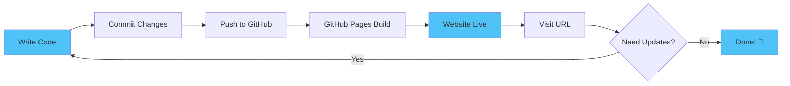

# Creating a Portfolio with GitHub Pages

A simple guide to be a 10x Developer

<div class="abs-br m-6 text-xl">
  <a href="https://github.com/neotechclub/" target="_blank" class="slidev-icon-btn">
    <carbon:logo-github />
  </a>
</div>

---
transition: fade-out
layout: two-cols
layoutClass: gap-16
---

# Static Websites

<v-clicks>

- 📄 Pre-built HTML, CSS, JS files
- 🚀 Served directly to the browser
- ⚡ No server-side processing
- 🔒 Fast, secure, and lightweight
- 🎯 Easy to host (e.g., on GitHub Pages)
- 💡 Examples: Blogs, portfolios, landing pages

</v-clicks>

::right::

# Dynamic Websites

<v-clicks>

- 🔄 Generated on-the-fly by a server
- 💾 Use databases, APIs, user input
- 🖥️ Server-side languages (e.g., Node.js, PHP)
- 🎮 Interactive features (logins, real-time data)
- ⚙️ More complex to maintain
- 🛒 Examples: Social media, e-commerce sites

</v-clicks>

---
layout: center
class: text-center
---

# Why Static for Portfolios?

<div v-click>

Static sites are ideal for portfolios: **simple**, **fast**, and **free** to host with GitHub Pages.

</div>

<div v-click mt-4>

No need for databases or complex servers! 🎉

</div>

---
transition: slide-up
---

# What is GitHub Pages?

<v-clicks>

- 🆓 **Free hosting service** by GitHub
- 🌐 Turns your repository into a website
- 📦 Supports static sites (HTML, CSS, JS)
- 🔗 Custom domains supported
- 📚 Uses: Personal sites, project docs, portfolios
- 🎯 URL: `https://username.github.io`

</v-clicks>

<div v-click mt-8>

<v-drag pos="663,350,261,_,-15">
  <div text-center text-2xl border border-main rounded p-4>
    Perfect for developers! 💻
  </div>
</v-drag>

</div>

---
layout: section
class: text-center
---

# Setting Up Your Portfolio

Using `username.github.io`

---

# Step 1: Create the Repository

<v-clicks>

1. 🌐 Go to GitHub and create a new repository
2. 📝 Name it exactly: `username.github.io`
   - Replace `username` with your GitHub username
3. 🔓 Make it public (required for free Pages)
4. ✅ Initialize with a README (optional)

</v-clicks>

<div v-click mt-8>

```bash
# Example repository name
john-doe.github.io
```

</div>

---

# Step 2: Add Your Content

<v-clicks depth="2">

- 📂 Clone the repo to your local machine
- 📄 Create an `index.html` file (your homepage)
- 🎨 Add CSS, JS, images as needed
- 🚀 Push to GitHub and you're live!

</v-clicks>

<div v-click mt-4>

Example `index.html`:

```html
<!DOCTYPE html>
<html lang="en">
<head>
  <title>My Portfolio</title>
  <link rel="stylesheet" href="styles.css">
</head>
<body>
  <h1>Welcome to My Portfolio</h1>
  <p>Showcasing my projects!</p>
</body>
</html>
```

</div>

---

# Step 3: Commit and Push

Push your changes to GitHub:

```bash {all|1|2|3|all}
git add .
git commit -m "Initial portfolio commit"
git push origin main
```

<div v-click mt-8>

Your site will be live at: `https://username.github.io` 🎉

</div>

<arrow v-click x1="400" y1="280" x2="400" y2="320" color="#4fc3f7" width="3" arrowSize="1" />

---

# Step 4: Customize Your Portfolio

<div grid="~ cols-2 gap-4">
<div>

<v-clicks>

- 🎨 Add custom CSS for styling
- 📱 Make it responsive
- 🖼️ Include project screenshots
- 📧 Add contact information
- 🔗 Link to GitHub repos
- 📊 Showcase your skills

</v-clicks>

</div>
<div v-click>

```css
/* styles.css */
body {
  font-family: 'Inter', sans-serif;
  background: linear-gradient(
    135deg, 
    #1a1a2e 0%, 
    #16213e 100%
  );
  color: #e0e0e0;
}

h1 {
  color: #4fc3f7;
  font-weight: 700;
}
```

</div>
</div>

---
layout: two-cols
layoutClass: gap-16
---

# Best Practices

<v-clicks>

- ✨ Keep it simple and clean
- 📱 Mobile-friendly design
- ⚡ Optimize images
- 🔍 Add SEO meta tags
- ♿ Ensure accessibility
- 🔄 Regular updates

</v-clicks>

::right::

# Useful Tools

<v-clicks>

- 🎨 **Bootstrap/Tailwind** - CSS frameworks
- 🖼️ **Font Awesome** - Icons
- 📝 **Google Fonts** - Typography
- 📊 **Chart.js** - Data visualization
- 🎭 **AOS** - Animations
- 🔧 **VS Code** - Code editor

</v-clicks>

---
layout: center
class: text-center
---

# Common Issues & Solutions

<div v-click>

### Site not showing up?

- ✅ Check repository is public
- ✅ Verify `index.html` exists
- ✅ Wait a few minutes for deployment
- ✅ Check GitHub Pages settings

</div>

<div v-click mt-8>

### Changes not appearing?

- 🔄 Hard refresh (Ctrl + Shift + R)
- 🥸 Try out the link in Incognito
- ⏱️ Wait for rebuild (1-2 minutes)
- 🧹 Clear browser cache

</div>

---
layout: center
---

# GitHub Actions Deployment

<v-clicks>

- 🤖 **Automate** your deployment process
- ⚡ **Build & deploy** on every push
- 🔧 Use `.github/workflows/deploy.yml`
- 🎯 Perfect for frameworks (React, Vue, etc.)

</v-clicks>

---
layout: center
---

# Traditional vs Actions

<v-clicks>

**Traditional (Static HTML)**
- ✅ Push HTML directly
- ✅ No build needed
- ✅ Simple & fast


**GitHub Actions**
- 🔨 Build on server
- 🤖 Automated workflow
- 🚀 Framework support

</v-clicks>

---

# Example Portfolio Structure

```
username.github.io/
├── index.html          # Homepage
├── about.html          # About page
├── projects.html       # Projects showcase
├── contact.html        # Contact form
├── css/
│   └── styles.css      # Main stylesheet
├── js/
│   └── script.js       # JavaScript
├── images/
│   ├── profile.jpg     # Your photo
│   └── projects/       # Project screenshots
└── README.md           # Repository info
```

---
layout: two-cols
layoutClass: gap-16
---

# Popular Portfolio Templates

<v-clicks>

- 🎨 **HTML5 UP** - Free templates
- 🎯 **Start Bootstrap** - Responsive themes
- 💎 **Creative Tim** - Premium designs
- 🌟 **Colorlib** - Modern layouts
- 🎭 **ThemeWagon** - Free themes

</v-clicks>

::right::

# Portfolio Inspiration

<v-clicks>

- 👨‍💻 GitHub profiles
- 🎨 Dribbble portfolios
- 💼 Behance showcases
- 🌐 Awwwards winners
- 📱 Developer portfolios

</v-clicks>

---
layout: center
---
# Diagram: GitHub Pages Workflow



---
layout: center
class: text-center
---

# Resources & Next Steps

<div grid="~ cols-2 gap-8" mt-8>

<div v-click>

### 📚 Learn More
- [GitHub Pages Docs](https://pages.github.com)
- [HTML/CSS Tutorials](https://developer.mozilla.org)
- [Web Dev Resources](https://web.dev)

</div>

<div v-click>

### 🚀 Take Action
- Create your repository today
- Build your first page
- Share with the world!

</div>

</div>

<div v-click mt-12>

**Questions?** Feel free to ask! 💬

</div>

---
layout: center
class: text-center
---

# Thank You!

Start building your portfolio today

<div class="abs-br m-6 text-xl">
  <a href="https://github.com" target="_blank" class="slidev-icon-btn">
    <carbon:logo-github />
  </a>
</div>